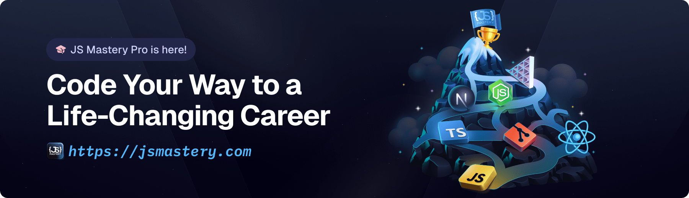

<div align="center">
 

  <h3 align="center">AI Security Linter</h3>

   <div align="center">
     Build this project step by step with our detailed tutorial on <a href="https://jsmastery.com/course/build-launch-your-saas-in-under-7-days" target="_blank"><b>JavaScript Mastery</b></a> platform. Join the JSM family!
    </div>
</div>

## 📋 <a name="table">Table of Contents</a>

1. 🤖 [Introduction](#introduction)
2. ⚙️ [Tech Stack](#tech-stack)
3. 🔋 [Features](#features)
4. 🤸 [Quick Start](#quick-start)
5. 🔗 [Assets](#links)
6. 🚀 [More](#more)


```env
# Clerk
NEXT_PUBLIC_CLERK_PUBLISHABLE_KEY=
CLERK_SECRET_KEY=
NEXT_PUBLIC_CLERK_SIGN_IN_URL=/sign-in
NEXT_PUBLIC_CLERK_SIGN_IN_FALLBACK_REDIRECT_URL=/
NEXT_PUBLIC_CLERK_SIGN_UP_FALLBACK_REDIRECT_URL=/

# Supabase
NEXT_PUBLIC_SUPABASE_URL=
NEXT_PUBLIC_SUPABASE_ANON_KEY=
```

Replace the placeholder values with your actual Supabase and Clerk credentials. You can obtain these by signing up on: [Supabase](https://supabase.com/dashboard), [Clerk](https://jsm.dev/converso-clerk).

**Running the Project**

```bash
npm run dev
```

Open [http://localhost:3000](http://localhost:3000) in your browser to view the project.

## <a name="links">🔗 Assets</a>

You can find the example database schema in the root of this repository.

## <a name="more">🚀 More</a>

**Advance your skills with Next.js Pro Course**

Enjoyed creating this project? Dive deeper into our PRO courses for a richer learning adventure. They're packed with
detailed explanations, cool features, and exercises to boost your skills. Give it a go!

<a href="https://jsm.dev/converso-nextjs" target="_blank">
  
</a>
